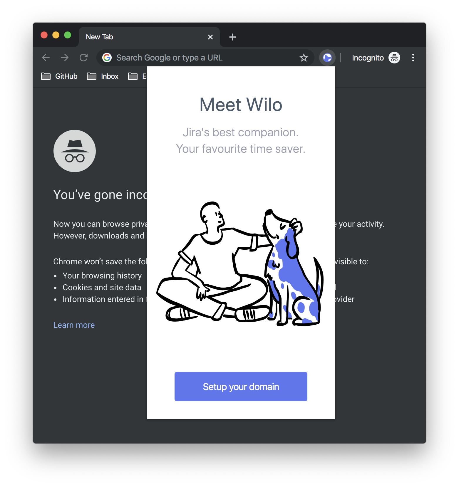
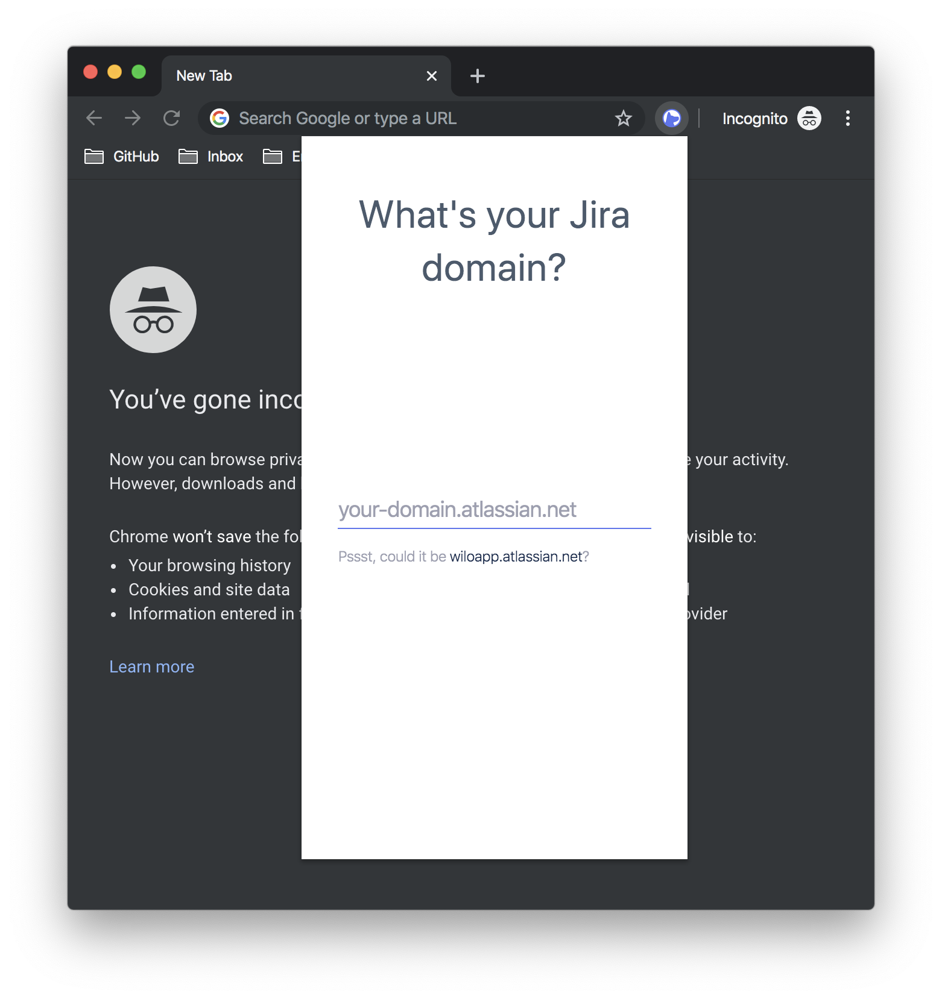
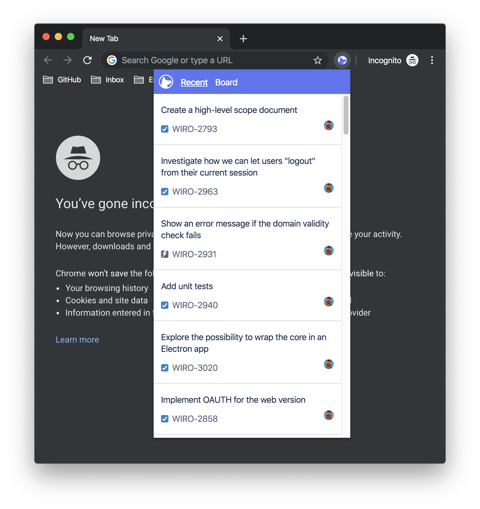

&nbsp;

# Wilo 

&nbsp;

Wilo is browser that improves the Jira user experience.  
Wilo is still a W.I.P.

&nbsp;

  

  

  

### Resources and acknowledgements

- Thanks to [Pablo Stanly](https://twitter.com/pablostanley) for the beautiful onboarding doodle. Make sure to check all its open source doodles at [opendoodles.com](https://www.opendoodles.com/).

## Contributing

See [./CONTRIBUTING.md](./CONTRIBUTING.md).  
Pull requests are welcome. File an issue for ideas, conversation or feedback.
